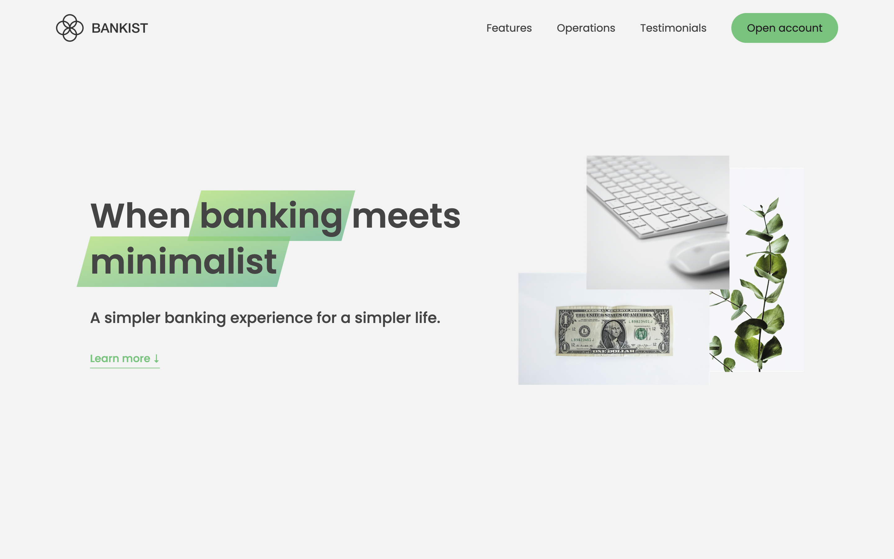
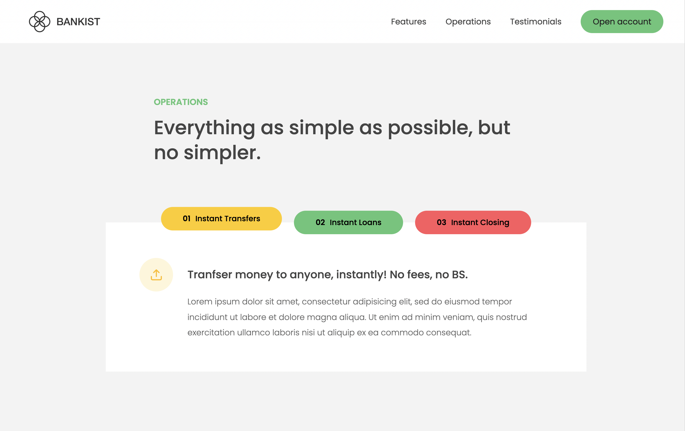
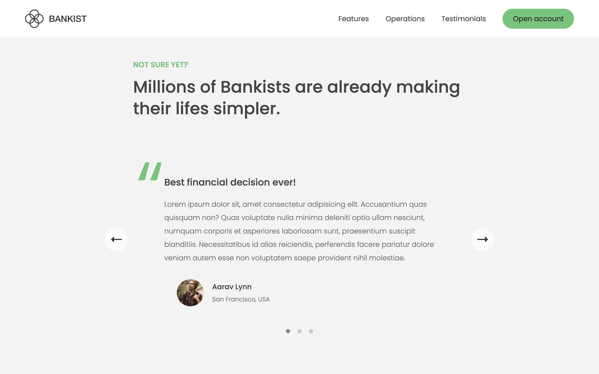

#

<h1 align="center">💰 Bankist 🏦</h1>
Welcome to our digital bank, where banking is simple and hassle-free. With our 100% digital platform, you can watch your money grow and easily manage your finances from anywhere. Plus, enjoy the convenience of instant transfers, loans, and account closing. And the best part? Your free debit card is already included. Join us today for a simpler banking experience and a simpler life.

Click [here](https://bankist-rajeev.netlify.app/) and Enjoy the Bankist.

  
  

## Features and Interfaces

1. Hero Section

   - Hero came with a navigation bar to nevigate the whole website.

   - Instant Open account button in navbar to open the instant account.

   - A great UI and branding to attract the user.

   - A button to Learn More about the features of Bankist.

   - A Hero image to represent the Bankist.

2. Features Section

   - 100% digital bank.

   - Watch your money grow.

   - Free debit card included.

3. Operations Section

   - Tranfser money to anyone, instantly! No fees, no BS.

   - Buy a home or make your dreams come true, with instant loans.

   - No longer need your account? No problem! Close it instantly.

   - 

4. Testimonial Section

   - Best financial decision ever!

   - The last step to becoming a complete minimalist

   - Finally free from old-school banks

   - 

## Functionalities

- Sticky Menu Bar.

- Smooth scrolling with Text.

- Blur effect and Lazy Loading in images.

- Close and Open PopUp Window.

- Operations with Tapped component.

- Testimonial Slider automatic and manual.

## Useful Links

- [Project Demo](https://bankist-rajeev.netlify.app/) for Web version.

- [Project Repository](https://github.com/Rajeevjewar/Bankist.git)

## Need help?

Feel free to contact me on [Twitter](https://twitter.com/be_rajeevkumar) or [LinkedIn](https://www.linkedin.com/in/berajeevkumar/), know more about me at my [Portfolio](https://iamrajeev.me).

<h1 align=center>Happy Coding 👨‍💻</h1>
